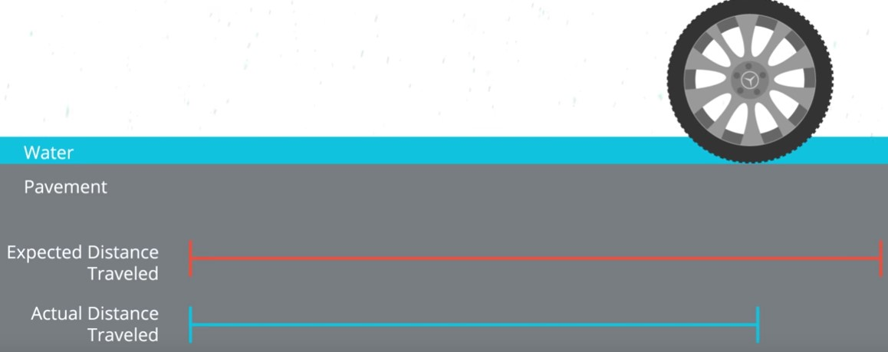

# Motion Model of a Car

Motion models are description of the physics of a vehicle. So when you have a car, for example you give gas, it doesn't go sideways, it goes forwards in a specific way and it might turn in circles and the math governing how vehicles move is called a motion model. 

A motion model is a big step for making a mobile robot drive itself. Motion models are also an important part of many localization algorithms. For example, in Bayesian methods, motion models are used in the predictive step you learned about in this [repository](https://github.com/A2Amir/keep-track-of-a-vehicle-s-coordinates).Now let's get started with some physics. In order to predict the location of a car, you need to take into account the way cars move and for that we have the bicycle motion model. 

The bicycle model is a simple and useful way to represent how a car moves. Like all models, it is based on several simplifying assumptions. 

* First, we all ignore all vertical dynamics of the car, so you can assume the car only moves in 2D. This means no flying cars, unfortunately. 

* Next, assume that like a bicycle the front wheels of the car are connected to the back wheels of the car by a rigid beam with fixed length. 

* Assume that the front two wheels act together so they can effectively be epresented as one wheel and The same holds for the two rear wheels.

* Assume the car is also controlled like a bicycle with a steering angle (theta) and some longitudinal velocity in the direction that the car is heading. 

 

You have just learned how the motion of a car can be simplified down to something similar to a bicycle with a bicycle motion model. Next, you'll get reminded how to use the car's heading and velocity of a car to find its new position. 

## Yaw Rate and Velocity

A car's heading, or Yaw angle, is its orientation. Yaw is often measured from the x-axis in map coordinates with counter clockwise angles being positive. In the bleow situation, the car's Yaw is positive pi over 4 radians. Assuming **constant** turn rate and velocity, the equations to find the new position of the car are shown below. 
 

 

If the Yaw rate is not zero, you have the below equations instead, because you'll have to take into account the change in the car's heading (Yaw) as it moves.
 
 

 
Next, other possible rotations of the vehicle besides the Yaw are below shown.

 
As mentioned, the Yaw is the rotation of the car about the z-axis. The other two possible rotations, around the x-axis and y-axis, are called roll and pitch respectively. The question is, will you need to calculate all three rotations to localize the car effectively?
The answer is, it is really depend on the road (i.e. the curvature and steepness) In really hilly places, the pitch of the car is pretty important. For most other roads though, the extra effort put into the extra calculations are usually not worth the miniscule improvement in accuracy.

## Odometry

let's look at another commonly used method using odometry, or motion sensor data. For mobile robots, odometry calmly comes from wheel sensors that measure how many times the wheels of the vehicle or robot have turned. 

For instance, the sensor on the below wheel would tell us it has turned twice. Given the circumference of the wheel and this odometry data, you can measure the distance traveledas indicated by the red line. More specifically, the new position of the car is the starting position of the car plus the x and y components of the odometry, multiplied by the circumference of the wheel. 
 
 

Odometry measurements might fail to report accurate position estimates.for example:

* On a slick wet road, wheel encoder odometry will incur large errors because the wheels will slip, causing them to travel less distance than expected, In addition, the wheels will also slide while braking, further contributing to sensor errors. 
 
 

 
* Roads with lots of bumps create problems for odometry because we are assuming the car travels a straight distance in the direction of its heading. In reality, with a bumpy road, the car is traveling much of this distance not in a straight line, but up and down. 

* On dry paved roads, however, the wheels will travel a distance very close to the expected circumference of the wheel. 

* On a road with lots of turns, wheel odometry works well because even though the heading of the car is changing, it's still moving the expected distance in the direction of its Yaw. 

 

